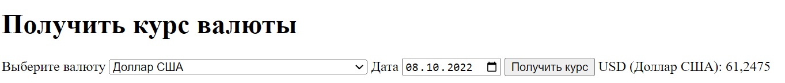

# CurrencyRates

Веб-приложение для получения курсов валют Центрального Банка Российской Федерации (ЦБ РФ) за определенную дату. Приложение использует [официальное API ЦБ РФ](https://www.cbr.ru/development/sxml/ "Документация к API ЦБ РФ") для получения данных.

## Установка

1. Клонируйте репозиторий или скачайте файлы проекта.

$ git clone https://github.com/paych3ck/CurrencyRates.git

2. Убедитесь, что у вас установлен Python версии 3 и выше.

python --version

3. Установите необходимые сторонние библиотеки, запустив команду:

pip install -r requirements.txt

## Использование

Запустите консоль и перейдите в директорию проекта.

Запустите Flask-приложение, выполнив следующую команду:

python app.py

Откройте ваш браузер и перейдите по адресу [http://localhost:5000](http://localhost:5000) для доступа к веб-интерфейсу утилиты.

- Сначала вам будет предложено выбрать код валюты из выпадающего списка.
- Затем выберите дату, на которую вы хотите получить курс валюты.
- Нажмите кнопку "Получить курс".

Результат будет отображен на странице и будет содержать информацию о курсе выбранной валюты для указанной даты.

## Используемые библиотеки

- Flask: фреймворк для создания веб-приложений.
- flask_wtf: расширение Flask, которое облегчает работу с формами в Flask-приложениях.
- WTForms: библиотека для создания форм в Python. В сочетании с flask_wtf, WTForms позволяет легко создавать и обрабатывать формы в Flask-приложениях.
- requests: для отправки HTTP-запросов и получения данных из API ЦБ РФ.
- xml.etree.ElementTree: для работы с XML данными, полученными от API ЦБ РФ.